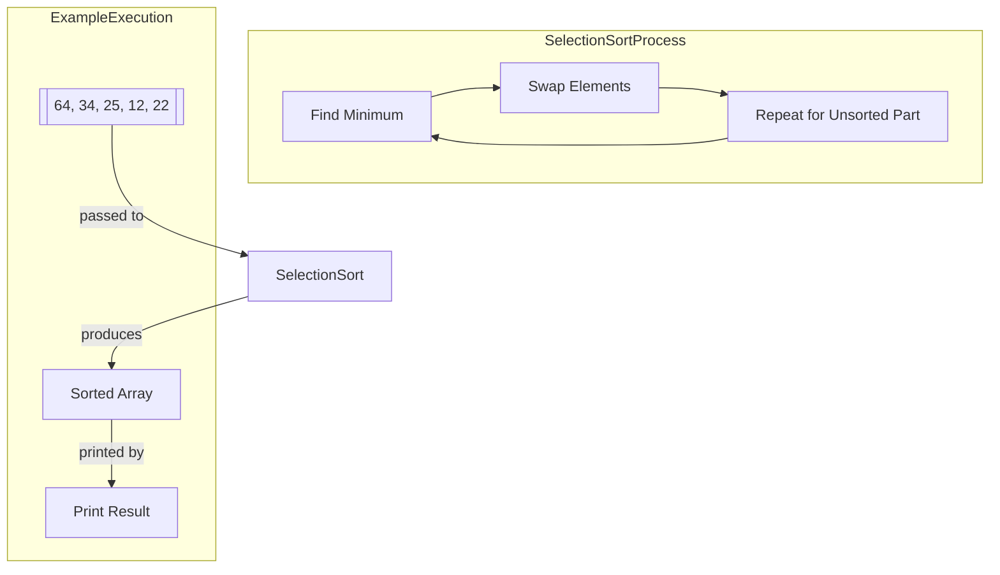

# Selection Sort Implementation in Java

This repository contains a Java implementation of the Selection Sort algorithm, 
an in-place comparison sorting algorithm with O(n²) time complexity.

## How to Run
1. Compile: `javac SelectionSort.java`
2. Execute: `java SelectionSort`

## Running Tests
Compile and run the test file:
```bash
javac -cp junit.jar SelectionSortTest.java
java -cp junit.jar:. org.junit.runner.JUnitCore SelectionSortTest
```

## Algorithm Diagram

